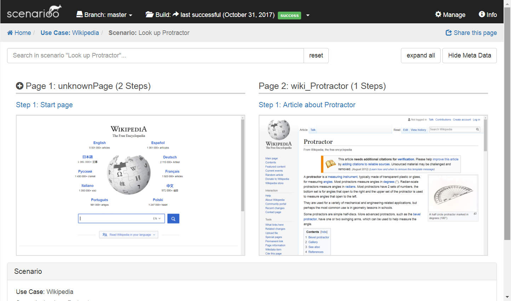

# Quickstart with ScenariooJS

The aim of this page is to describe the minimal viable setup of Scenarioo from scratch using `protractor` and the `scenarioo-js` writer library.

For more detailed informations about Scenarioo-JS and its usage please refer to the documentation of ScenariooJS here: [ScenariooJS Documentation](https://www.npmjs.com/package/scenarioo-js)

## Prerequisites

Install the [latest npm LTS version](https://nodejs.org/en/)

Install the [latest Google Chrome version](https://www.google.ch/chrome)


## Minimal Protractor Test

Create an empty folder for the project.

Open the folder in a console.

Create an initial `package.json` file:

```
npm init -y
```

Install [protractor](http://www.protractortest.org):

```
npm install -D protractor
```

Create folder `tests` with file `wikipediaTest.js`. Add content:

```
describe("Wikipedia", function() {

    it("Look up Protractor", function() {
        browser.get("http://www.wikipedia.org");
        element(by.id('searchInput')).sendKeys('Protractor');
        element(by.css('#search-form button')).click();
        expect(element(by.id('firstHeading')).getText()).toBe("Protractor");
    });

});
```

Add file `protractor.conf.js` in project folder, add content (`waitForAngularEnabled()` is required because the page we are going to test is not an Angular page):

```
exports.config = {
    specs: [ "tests/*.js"],
    onPrepare: function() {
        browser.waitForAngularEnabled(false);
    }
}
```

Add script to `package.json`:

```
  "scripts": {
    "pretest": "webdriver-manager update",
    "test": "protractor protractor.conf.js"
  },
```

Run the test:

```
npm test
```


## Minimal Scenarioo Integration

Add the scenarioo-js writer library:

```
npm install -D scenarioo-js
```


Extend `protractor.conf.js` as follows.

a) Add at the beginning of the file:

```
var scenarioo = require("./node_modules/scenarioo-js");
```

b) Add in `onPrepare` function:

```
scenarioo.setupJasmineReporter(jasmine, {
    targetDirectory: 'scenarioo-output',
    branchName: 'master',
    branchDescription: '',
    buildName: 'build_' + new Date().getTime(),
    revision: ''
});
```

Change the test `wikipediaTest.js` by adding a `require` statement for Scenarioo and `scenarioo.step()` calls after each action:


```
var scenarioo = require("../node_modules/scenarioo-js");

describe("Wikipedia", function() {

    it("Look up Protractor", function() {
        browser.get("http://www.wikipedia.org");
        scenarioo.step("Start page");

        element(by.id('searchInput')).sendKeys('Protractor');
        scenarioo.step("Entered search term");

        element(by.css('#search-form button')).click();
        scenarioo.step("Article about Protractor");

        expect(element(by.id('firstHeading')).getText()).toBe("Protractor");
    });

});
```

Run the test again (as we have integrated Scenarioo now):

```
npm test
```

> Disclaimer: we are using the legacy (plain Jasmine) syntax for this example to keep it as simple as possible. We recommend using the [Scenarioo Fluent DSL](https://github.com/scenarioo/scenarioo-js/blob/develop/README.md#scenarioo-fluent-dsl) instead, as it has many advantages.


## Install Viewer to Browse Output

* Download [Tomcat 9](https://tomcat.apache.org)

* Unzip Tomcat

* Add line to `context.xml` of Tomcat pointing to the subfolder `scenarioo-output` of your project:

```
<Parameter name="scenariooDataDirectory" value="D:\Code\scenarioo-demo\scenarioo-output" override="true" />
```

* Download the [latest Scenarioo development build](http://build.scenarioo.org/jenkins/job/scenarioo-ci-pipeline/job/develop/lastSuccessfulBuild/artifact/scenarioo-server/build/libs/). (This is currently required because the released version does not have the simple configuration option we use here yet).

* Move Scenarioo `*.war` file into `webapps` folder of Tomcat and rename it to `scenarioo.war`.

* Start up Tomcat using the startup script (`startup.bat` or `startup.sh` depending on your platform).

* Access Scenarioo viewer under: http://localhost:8080/scenarioo

* If you can't access this page, make sure no other application is using port `8080`.

* Click the use case "Wikipedia" and then the scenario "Look up Protractor". You should see this screen:


