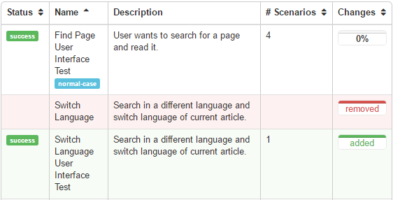
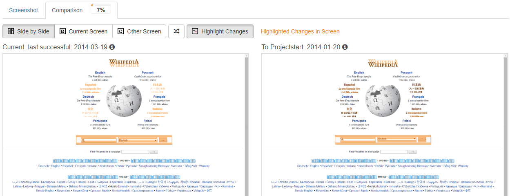
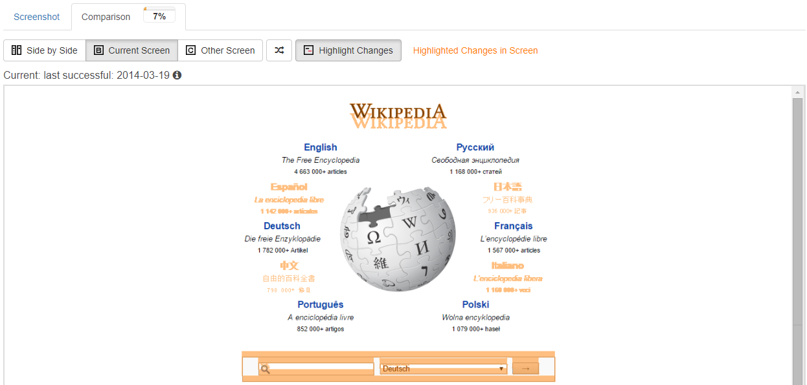

# Diff Viewer User Guide

This guide describes how to use the Scenarioo Diff Viewer feature.

The Diff Viewer feature makes it possible to compare two different builds against each other, to see changes between your scenarios in two builds.

The Diff Viewer compares all the screenshots of all your tests and shows you where you have how much changes. Also it compares structural changes in your tests, like added or removed scenarios or use cases, or added or removed steps inside test scenarios.

The following sections describe how you can create, browse, configure, manage and even delete such Diff Viewer comparisons:

1. [Create Comparison Manually](#create-comparison-manually)
2. [Select Comparison to Browse](#select-comparison-to-browse)
3. [Browse Comparison Differences](#browse-comparison-differences)
4. [Hide Comparisons](#hide-comparisons)
5. [Configuration of Automatic Comparisons](#configuration-of-automatic-comparisons)
6. [Integrate Comparisons in CI Pipeline](#integrate-comparisons-in-ci-pipeline)
7. [Manage Comparisons](#manage-comparisons)
8. [Delete Comparisons](#delete-comparisons)

## Create Comparison Manually

In the Scenarioo Viewer simply choose `Create Comparison ...` from the top right in the Scenarioo navigation bar.

Provide following information:

* **Comparison Name:** this is the name under which you can browse the comparison results
* **Target Build:** the build on which the comparison will be calculated and on which it can be selected for browsing
* **Compare with:** the other build to compare with

When you submit the dialog, the comparison is calculated in the background. 

Once the comparison calculation was successful you will see it in the Comparisons drop down in the top navigation bar.

You have to reload the page to get the new comparison listed.

## Select Comparison to Browse

Once a Comparison is available you can browse it on the target build where it has been calculated.
The `Comparison` selection drop down menu is located in the top navigation bar to the right oft the build selection drop down menu.

If no `Comparison` drop down menu is shown, then no comparison is currently available on current selected build. Either try to choose another build or reload the page for calculated comparisons to become available.

You can change the selected comparison at any time, on every Scenarioo page. It does not matter if you are on the page view or on the use case overview. The Diff Viewer will show the difference between the two builds immediately. 

The last selected comparison will be stored in your browser. Therefore you can reload the page without loosing your selected comparison.

The following screenshot shows the comparison menu on our [Demo Site](http://demo.scenarioo.org/scenarioo-fork-diffviewer/)


## Browse Comparison Differences

Diff Information is integrated into existing pages. You will see the Diff Information right next to each associated item. The information is displayed in a progress bar like diff icon.

The following screenshot shows a diff icon example:


### Colors

* **Green:** New elements
* **Orange:** Changed elements
* **Red:** Removed elements

### Change Rate

The Change Rate is the average value of all changes in the underlying elements. Added or removed elements will be calculated as 100% changed.

The length of the entire progress bar corresponds to the change rate. The length of each color progress bar corresponds to the number of changed elements.

### Added and Removed Elements

Furthermore, added or removed elements are labelled accordingly. To ensure you recognize these elements immediately they are highlighted as in the following screenshot:



## Compare Screenshots

You can open the screenshot comparison in the step view by navigating to the `Comparison` tab.

### Views

Diff Viewer comes with different views to compare a screenshot. You can switch between these two views:

Side by side view:



Single page view:



## Hide Comparisons
On the same place where you [selected a comparison](#select-comparison-to-browse), you can disable the Diff Viewer feature.
Simply select 'Disable' in the comparison selection menu:


## Configuration of Automatic Comparisons

You can configure Scenarioo to automatically compute comparisons for you on each new build on a specific branch.

In the Scenarioo `config.xml` file you can edit the comparison configuration. It is possible to add one or more comparison configurations. On each import, all the configured comparisons get compared.
You can delete a comparisonConfiguration, then it will not be compared in the future. The old comparisons will not be deleted automatically. Check out [Delete Comparison](#delete-comparisons) for further details.

Each comparisonConfiguration has the following settings:

* **name**: name of the comparison. This is the name that gets displayed in the Viewer to select a comparison result for displaying it. 
   As soon as the comparison is calculated for a build you can select it in the comparison selection menu in the frontend on that build.
* **baseBranchName**: name or alias of the branch for which to perform such a comparison calculation on each new build being imported for that branch. 
* **comparisonBranchName**: name or alias of the branch to which to compare (can be the same branch as well).
* **comparisonBuildName**: the name or alias of the build to which to compare to. Some examples:
    * "last successful": alias for the last successful build (as configured in configuration as well)
    * "most recent": alias for the most recent build (as configured in configuration as well)
    * the original build name    

Example Configuration:
   ```xml
<?xml version="1.0" encoding="UTF-8" standalone="yes"?>
<configuration>

    ...

    <comparisonConfigurations>

        <comparisonConfiguration>
            <name>To last successful</name>
            <baseBranchName>wikipedia-docu-example-dev</baseBranchName>
            <comparisonBranchName>wikipedia-docu-example</comparisonBranchName>
            <comparisonBuildName>last successful</comparisonBuildName>
        </comparisonConfiguration>

        <comparisonConfiguration>
            <name>To most recent</name>
            <baseBranchName>wikipedia-docu-example-dev</baseBranchName>
            <comparisonBranchName>Production</comparisonBranchName>
            <comparisonBuildName>most recent</comparisonBuildName>
        </comparisonConfiguration>

        <comparisonConfiguration>
            <name>To Projectstart</name>
            <baseBranchName>wikipedia-docu-example-dev</baseBranchName>
            <comparisonBranchName>Production</comparisonBranchName>
            <comparisonBuildName>2014-01-20</comparisonBuildName>
        </comparisonConfiguration>

    </comparisonConfigurations>

    ...

</configuration>
```
   
Once you configured automatic comparisons to be calculated you can trigger automatic comparison calculations as follows:

* Reimport an existing build:
   * Scenario Viewer > Manage > Click on the reimport symbol next to the preferred build
   * NOTE: The "Import & Update Builds" Button will only start a comparison if a build gets imported for the first time.
* Create a new build and upload it to Scenarioo in the usual way (see [Publish Scenarioo Documentation Data](../../tutorial/Publish-Documentation-Data.md)).


## Integrate Comparisons in CI Pipeline

You can trigger comparisons from your CI pipeline to do visual regression testing.

See: [Diff Viewer REST API](diff-viewer-rest-api.md).


## Manage Comparisons

In the `Manage`-view there is a `Comparisons` tab that lists all calculated comparisons with further information. 

There you can also see error logs in case a calculation of a comparison failed in the `Details & Logs` dialog.


## Delete Comparisons

All comparisons are stored inside the build directory of their target build inside a subfolder `comparisons.derived`.

To delete a comparison you only have to delete the appropriate folder. You have the following options:

* Delete all the comparisons of a build at once
* Delete selected comparisons

A file structure example:

* Root Folder
  * branchName1
    * buildName1.1
      * **comparisons.derived**
        * comparison1
        * comparison2
        * ...
      * useCaseName1
        * scenarioName1
          * ...
    * buildName2
         * **comparisons.derived**
           * ...
         * useCaseName1
           * scenarioName1
             * ...      
  * branchName2
     * buildName3
       * **comparisons.derived**
         * ...
       * useCaseName1
         * scenarioName1
           * ...

When you delete a build directory also all contained comparisons will be removed.
